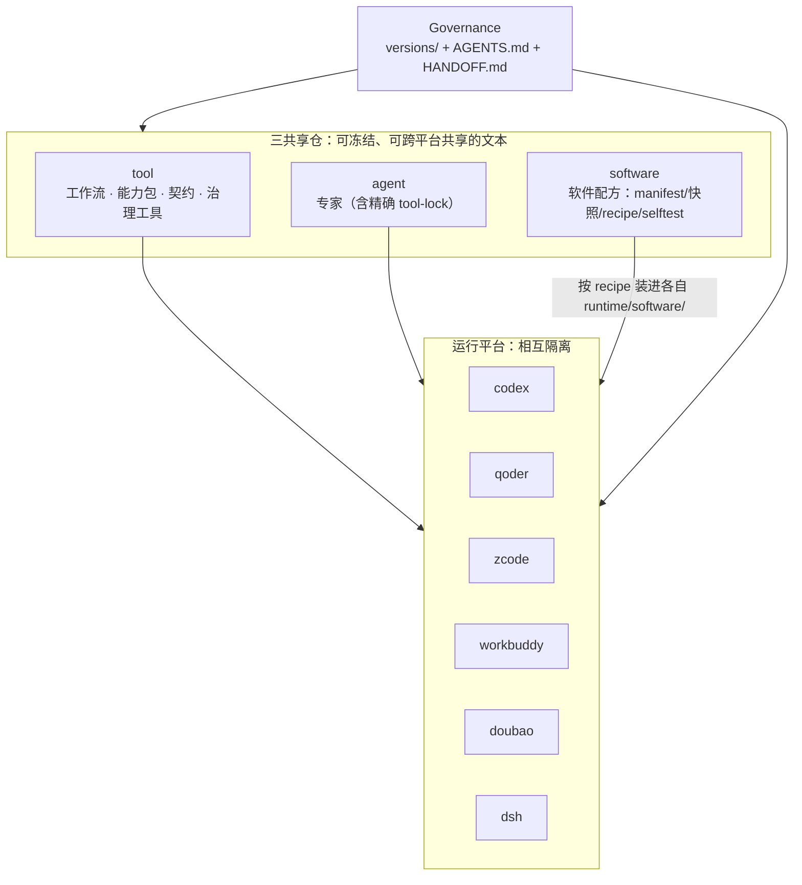

# 当前架构概览

一页看清 `E:\ai` 这套东西的形状：三仓骨架、六个运行平台、五类读者各自该从哪儿进。**版本号一律去自动生成的目录页看**，本页不抄数字——抄一次就会有一天对不上。

## 一、骨架：三共享仓 + 若干运行平台

三仓**同构**：`registry.json` 索引 + 逐资源 `current.json` 指针 + 语义化 `versions/<semver>/` 目录 + 逐版本 `SHA256SUMS` + 一句话切默认。这个同构形态本身是条文（BP-1），任何升级、平台接入或工具整合都不能把它合并、降级，或在平台目录里另建平行功能面绕过它。

**已发布版本只读**。要出新版本就新建语义化目录，再切指针；`software` 仓只放配方文本，软件本体由各平台按 recipe 装进自己的 `runtime/software/`。

## 二、五个必须先分清的口径

| 口径 | 意思 | 不分清会怎样 |
|---|---|---|
| **发布 ≠ 采纳** | 目录页显示的是"已发布的当前指针"，不是"某平台正在用它跑" | 把"发了 0.9.0"读成"所有平台在跑 0.9.0" |
| **选版 ≠ 切指针** | 某平台在自己的 config 里显式钉版，不改动共享 `current` | 以为一个平台的自证抬了全场的针 |
| **结论不互抄** | 每个平台对自己的能力面独立复验，一个平台不为另一个平台申报 | 拿 A 平台的 `FAIL 0` 给 B 平台背书 |
| **判据有唯一载体** | 每轮更新只认它那一份定稿实施表；定稿后不得加码（BP-5） | "跑完了还不算完成"，验收无限续期 |
| **提案不是授权** | 带 提案 · 未定稿 的文档只有目标形状和 P 表 | 把 3.1.0 的设想当成已经发生的事 |

红线（已发布版本只读、run 必钉版、哈希可回读、不谎报、未授权不写共享仓、数模档位、主机执行降级须当次同意）不因"最小量""对等""无缝"而削减。

## 三、去哪儿看当前状态

| 你要问的问题 | 去哪儿 |
|---|---|
| 上位原则条文与判据 | [架构基本原则 BP-1 ~ BP-7](/docs/architecture/basic-principles) |
| 现在这版架构长什么样 | [架构 3.0.0（当前基线）](/docs/architecture/3.0.0) |
| 这版怎么算做完 | [3.0.0 定稿实施表 S-P1…S-P9 + 裁定 C-1…C-9](/docs/architecture/3.0.0-final-plan) |
| 哪些文件在起作用 | [架构 3.0.0 文件地图](/docs/architecture/3.0.0-file-map) |
| 各平台接入到哪一步 | [平台接入清单](/docs/architecture/platform-checklist) ＋ [平台状态读数](/reference/platforms) |
| 共享侧现在指着哪个版本 | [工作流目录](/reference/workflows) · [专家目录](/reference/agents) · [软件配方目录](/reference/software) |
| 运行时要钉住什么 | [运行契约速览](/docs/runtime/orientation) ＋ [契约包版本卡片](/reference/contracts/runtime-contracts) |
| 调用侧口径与档位 | [调用适配规范](/docs/runtime/invocation-adapters) |
| 还没做完的事 | [当前开放事项](/docs/history/open-items) |

## 四、按角色读

**第一次接触这套体系**：本页 → [文档站说明](/docs/quick-start/site-intro) → [E:\ai 总框架](/docs/quick-start/handoff) → [基本原则](/docs/architecture/basic-principles)。

**要跑一个 workflow / 专家**：[运行契约速览](/docs/runtime/orientation) → [调用适配规范](/docs/runtime/invocation-adapters) → 对应资源的[版本卡片](/reference/workflows)。数模相关先确认档位，未写档位＝草稿。

**要接入或自证一个平台**：[平台接入清单](/docs/architecture/platform-checklist) → 该平台的[状态页](/reference/platforms) → [恢复手册](/docs/architecture/2.0.0-recovery)。

**要改架构**：[基本原则 BP-5](/docs/architecture/basic-principles) → 上一轮的定稿实施表 → 出新版本目录并切指针，**先有可回滚的 commit 再做破坏性动作**（BP-6）。

## 五、这段描述的可信度边界

本页与所有导览页由 `docs-site/content/` 撰写，属于**二手描述**；条文与读数的第一手来源始终是 `E:\ai` 原文与三仓注册表。二者冲突时以原文为准——每页顶部横幅给出源文件路径与 SHA-256，`node scripts/docs-conform.mjs` 一条命令复算。
