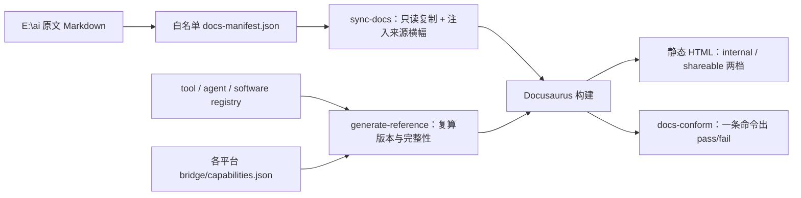

# 文档站说明

> 这一页只回答三件事：这个站**是什么**、内容**从哪来**、你怎么**验证它没骗你**。

## 一、它是什么

`E:\ai` 的治理文本、运行契约与三仓注册表读数，装成一个静态文档站：顶部导航、左侧分类、右侧页内目录、全文搜索、深色模式、代码块复制。

它是一台**生成器**的产物，不是一份可以编辑的文档。



## 二、内容从哪来，边界在哪

| 面 | 事实来源 | 本站的处理 |
|---|---|---|
| 治理原文 | `AGENTS.md`、`HANDOFF.md`、`versions/*.md`、`invocation-adapters-spec.md` 等 | 白名单点名，构建时**只读复制**，一个字节不写回 |
| 三仓目录与版本号 | `tool/registry.json`、`agent/registry.json`、`software/registry.json` + 逐资源 `current.json` + `SHA256SUMS` | 全部脚本复算，**没有一个版本号是手抄的** |
| 平台读数 | 各平台自己的 `<platform>/bridge/capabilities.json` | 一个平台只读它自己的文件，结论不互抄（BP-2） |
| 导览页（含本页） | `docs-site/content/` | 站点撰写，同样进白名单、同样带来源横幅 |

**默认排除、永不进构建**（清单见 `data/exclude.json`，每条带理由）：各平台 `runtime/` 的日志与运行产物、`tool/_sources/` 上游快照、软件本体（含 `software/phpStudy_64/`）、venv 与缓存、凭据类文件、`inbox/`、学习笔记、未经审核的实验文档。

白名单之外的原文**不会**因为"它存在"就出现在站上；要加一页，就在 `data/docs-manifest.json` 里加一条并写明 `status` 与 `visibility`。

## 三、页面徽章的读法

每页顶部横幅固定给出：状态、事实来源路径、源文件 SHA-256（前 12 位）、原文最近修改时间、本站审核日期、发布档位。

状态词表就五个，刻意不共用：

| 徽章 | 含义 | 你能拿它做什么 |
|---|---|---|
| <span class="pill pill--ok">当前有效</span> | 现在就要向它对齐的条文 | 直接引用 |
| <span class="pill pill--info">配套现行</span> | 判据、实施表、台账、迁移/恢复手册 | 查"怎么算做完" |
| <span class="pill pill--warn">历史基线</span> | 已被更新基线接替，但部分章节仍是现行载体 | 读正文前先看它的加注 |
| <span class="pill pill--muted">冻结历史</span> | 原文不改，只作历史 | 不得当作现状引用 |
| <span class="pill pill--danger">提案 · 未定稿</span> | 目标形状 + P 表，**不是实施授权** | 只能用来讨论，不能当作已发生 |

## 四、两种产物

| 档位 | 内容 | 用途 |
|---|---|---|
| `internal` | 白名单全量 | 内网/本机自阅，含平台路径与台账 |
| `shareable` | 只有 `visibility: public` 的条目 | 可以整目录丢到公网或对外发的最小面 |

```bash
npm run build              # internal → build/internal/
npm run build:shareable    # shareable → build/shareable/
```

## 五、怎么验证一页没被改过

```bash
node scripts/inventory.mjs          # 盘上有多少 Markdown、白名单覆盖了哪些
npm run build                       # 同步 → 生成 → 构建
node scripts/docs-conform.mjs       # C1…C11 一条命令出 PASS/FAIL 与摘要
```

`docs-conform`（C1…C11）会告诉你：白名单源文件是否齐全、盘上原文哈希与来源锁是否一致（不一致＝原文变了但你没重跑同步）、参考页是否与注册表当前指针一致、站内是否有断链、当前页是否把提案写成现状、产物里有没有凭据或危险路径。报告落 `data/conform-report.json`，摘要是一个可对比的 SHA-256。

## 六、已知边界（不藏）

- 搜索索引在构建时生成，**需要一个静态服务器**（`npm run serve` 或 Nginx/Caddy/GitHub Pages）；直接把 `build/internal/index.html` 拖进浏览器可以翻页，但搜索框不可用。
- 英文不是自动翻译。要出英文版时单独维护翻译状态，避免两语言语义漂移；届时把 `'en'` 加进 `docusaurus.config.ts` 的 `i18n.locales`。
- Docusaurus 的**版本选择器**（`docs:version`）目前没启用：架构版本在这里是**文档主题**而不是站点快照，靠状态徽章区分更准。真要冻结某一天的整站阅读面时，再切一次 site version。
- `node_modules/`（1,409 个包）与 `build/` 都不入库，重建配方是 `package.json` + `package-lock.json` + 一条 `npm ci`；按 BP-7 这属于"可重建件"。
