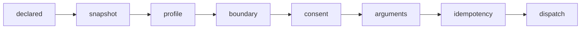

# 运行契约速览

把散在多份治理文本里的**运行期不变量**串成一页。每条都指回它的定义处；本页只是索引，不是新的判据来源。

## 一、每次运行都要钉版

调用任何 workflow / 专家时，开始时固定 agent、工作流、技能、能力包与依赖版本，并把**版本与解析来源**写进本平台 `runtime/runs/<run-id>/run-lock.json`。

- 锁的 schema：`ai-run-lock/v1.2`（2.1 代）与 `ai-run-lock/v1.3`（3.0 代，多记网关字节、声明释放版、快照摘要、逐阶段实例模式）。两种形态都要能在真 run 里读到。
- 专家内部调用服从精确 `tool-lock`；**本平台的默认覆盖不能改变共享 `current`，也不能绕过专家锁**。
- "没有密封脚本环境"是一种**合法**的锁形态，不是错误状态：提示词面照常跑到 `succeeded`，脚本面回答结构化的 `CAPABILITY_UNAVAILABLE` 且不留半截产物。

定义处：[调用适配规范](/docs/runtime/invocation-adapters)、[runtime-contracts 版本卡片](/reference/contracts/runtime-contracts)、[resolution 契约](/reference/contracts/resolution)、[run-layout 契约](/reference/contracts/run-layout)。

## 二、档位（rigor）：只管开销，不管"能不能用"

调 `math-modeling-programmer`（直调或经专家）时所有平台共用同一档位口径，细则在调用适配规范 §3.1：

| 你写的 | 引擎做的 | 锁里记的 |
|---|---|---|
| 什么都不写 | **草稿**：只做点名范围；不 INIT 已有项目、不重跑求解器、不扫参、不独立验证、不过严图、不冻结 | `rigor=balanced`、`frozen=false` |
| 「过图」 | 才跑非严格 QA | — |
| 「交稿」 | 才走该问所需九阶段并冻结 | `frozen=true` |

非交稿**不得**称为"已验证"或"已冻结"。禁止用 runner INIT 清空已有项目。三档在**功能面**一视同仁，差异只体现在门禁执行、seal 文档与往返次数上。

## 三、软件面：`software-call` 的固定八步

引擎的第四种阶段动作，八步顺序不可调换，**每一步都有负例，且失败一律发生在派发之前**：

- 快照**未冻结** ⇒ `CAPABILITY_UNAVAILABLE` 并点名配方字段，**绝不报成 `SOFTWARE_DRIFT`**（这是漂移检测分两半的直接后果）。
- 幂等靠引擎算键 + 独占 intent 锚点 + 网关重放锚：同一调用重跑答 `replayed`，**不重复派发**。
- 本体只由各平台按 recipe 装进自己的 `runtime/software/`；配方仓只放文本。

配方与快照的冻结状态见[软件配方目录](/reference/software)。

## 四、并发与资源仲裁

| 场景 | 观测到的行为 |
|---|---|
| 两个 run 用**各自**的项目副本 | body 存活区间可重叠，证据互不串（C6） |
| 同一项目副本起第二个 run | 在 prepare 即 `RESOURCE_BUSY`，**连 run 目录都不创建**（C7） |
| singleton 资源被占 | 被拒方 `SOFTWARE_BUSY`（retryable），从未进入 body、无 evidence、无台账行、状态修订未变 |
| 进程中途死掉后再进同一阶段 | 答 `REVISION_CONFLICT` ＝ **不重复派发**（不是"自动回收"，别把这条读成断点续跑） |

跨平台仲裁仍未满足：锁表目前只在平台内，跨平台需要单独授权（BP-4 §4.5，承 2.1-A 的 P8b 交接件）。

## 五、跨平台续跑（BP-4）

一个项目拆成多个 run、分布在多平台执行时，功能面、版本语义与操作方式必须与在单一平台连续执行**等价**。三项机制缺一即未满足：

1. **平台中立的项目状态层**：可写状态、跨 run 版本锁、阶段结论与产物摘要以带 sha256 的中立交接包（`handoff-bundle/v1`）或共享项目根承载——这是唯一被许可的跨平台状态通道；**任何平台不得直读别平台的 `runtime/**`**。
2. **续跑版本一致性校验**：不一致必须明确警告或拒绝，**不得静默换版**。
3. **跨平台资源仲裁**：互斥键要在所有平台之间有效；单平台网关内部状态目录不算。

进行中的单个 run 不做在线热迁移——这是设计边界，但不能拿它拒绝上面三项。

## 六、脚本执行降级阶梯

`kernel-sandbox → platform-venv → host-controlled`。走到主机一档**必须本次请求自带用户同意**，且同意摘要进锁；未同意就 fail-closed。

采纳 0.8.0 及以后引擎的平台必须在自己 config 里声明 `scriptEnvironmentRungs`；只带旧单键 `executionBackend` 的配置，脚本派发会 fail-closed 而不是静默沿用。

## 七、这里没写的

本页刻意不给"当前共享指针是什么版本"——那种数字会过时，去看[工作流目录](/reference/workflows)与[契约版本卡片](/reference/contracts/runtime-contracts)，它们是构建时从注册表复算的。

## 八、手动接入入口

架构管理台提供统一的“手动接入向导”。选择已有的 platform、tool、agent 或 software 后，管理台读取目标文件、显示基线 SHA-256，并生成 `plan → confirm → verify` 计划：平台写已有 bridge/config，三仓资源切换已发布 `current` 或编辑 registry。目标必须位于工作区已有目录中，父目录不存在时拒绝；外部改动、版本未发布、JSON 不合法或疑似凭据明文都会在计划阶段阻止。DSH 使用同一 bridge/config 流程；特殊软件能力验证仍由其连接器或平台流程负责，不由管理台伪造。
